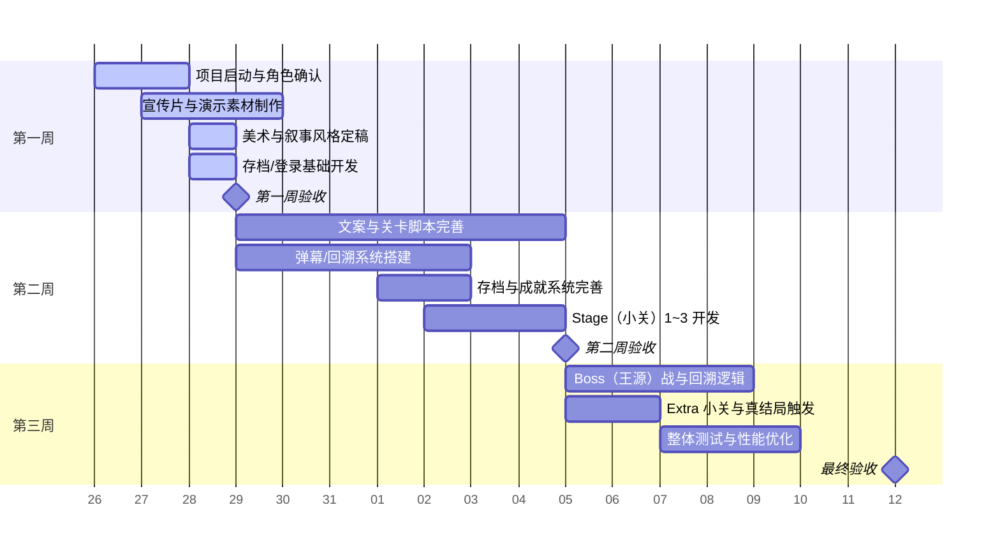

# 再见珍珠

## 1. 项目概述

- **项目名（暂定）**：再见珍珠
- **核心概念**：以丁真为主角的抽象叙事横板解谜 / STG 混合体。由多个横板解谜小关组成，关卡之间穿插视觉小说式对话；最终为弹幕 Boss 战。
- **风格取向**：像素风横板解谜、东方风弹幕，抽象的叙事风格！
- **目标平台** Web（HTML5 + JS，键鼠操控，兼容主流现代浏览器；不支持 IE）。

## 2. 核心玩法与关卡结构

### 1. 基本循环

1. 玩家进入「横板解谜小关卡」：侧重环境交互与短时动作（跳跃、机关交互、走位）。
2. 关卡结尾触发视觉小说段落（短对话 / 内心独白），推进碎片化剧情。
3. 达到节点后触发 Boss 弹幕战：以抽象弹幕表现芙蓉王与锐刻五代之间传统派和革新派的矛盾。
4. Boss 战结束后，根据玩家在关卡中发现的线索数与战斗表现，判定结局分支（假结局 / 普通结局 / 真结局 / 彩蛋结局）。

### 2. 关卡设计

- 每关为独立关，强调环境交互（检视、触发机关），可能含有跑酷元素。
- 解谜元素与线索并行：线索用于推动“真相进度”，并在最终结局中发挥作用。
- 关卡之间以视觉小说段落连接：对话简短而抽象、富象征意味，避免直白说明，让玩家彻底蒙圈。

### 3. 特殊机制

- **好想抽锐刻**：丁真半分钟不抽锐刻五就会发癫，玩家需在倒计时内到达锐刻五物品处进行交互，否则触发关卡失败。
- **葬送的芙蓉王**：王源因 CERN 的实验影响拥有了“时间回溯”能力（人称葬送的芙蓉王），回溯时可在当前所在位置回到过去的时间点，可以超级加倍。
- **打破回溯方法**：玩家了解回溯机制后可在关卡内发现隐藏道路，进入全新关卡并最终找到“回溯能量核心”，摧毁并解决 SERN 引发的异变。

## 3. 剧情分支与结局

- **假结局**：丁真挑战王源，起初占上风，王源邪魅一笑使用秘密武器，丁真遇到几十个王源的围殴（这些都是不久后回溯回来的他自己），拼尽全力无法战胜。

- **普通结局**：重来后，丁真借助王源的秘密武器（回溯）重走关卡，寻得隐藏道路，发现回溯源于 SERN 的异变，破坏 SERN 后回溯能力消失，最终与王源进行正常的弹幕对战并收束故事。

- **真结局**：玩家在重走关卡期间收集足够线索（可交互物品、记忆碎片），在最终对战后揭示 SERN 的真相，丁真告知王源真相并与之和解，大家一起包饺子。

- **彩蛋结局 A（neta 星际拓荒）**：若玩家在回溯过程中设法打破过去自己的行动轨迹，将会触发时空结构崩坏的实验性结局，呈现规则崩溃的视觉表现。

- **彩蛋结局 B（neta 东方）**：击败具备回溯能力的王源，进入“还是 STG 大神”的致敬彩蛋。

## 4. 技术方案

- **前端与渲染**：

  - 基础：HTML5 + ES6 Javascript
  - 渲染：主用 Canvas2D，弹幕采用 WebGL 保证性能
  - 音频：WebAudio API

- **todo**：
  - [] JSON 关卡描述
  - [] 弹幕脚本语言
  - [] 本地存档

## 5. 角色与分工

- **产品经理/CIO（胡文涛）**：总体进度管理、需求规划与里程碑把控。
- **技术总监（张振宇）**：技术架构设计、核心引擎开发与技术难点攻关。
- **程序员（张梓轩）**：引擎开发、存档/登录功能实现。
- **文案/美工（吴楠）**：视觉小说台词创作、关卡线索设计、UI 界面与场景美术。
- **测试/关卡设计（牛浩羽）**：关卡逻辑设计、游戏流程测试与 bug 修复。
- **网站编辑（郭清玥）**：项目宣传内容制作、演示视频剪辑与推广素材。

## 8. 测试与质量保证

- 流程测试：关卡设计完毕后进行试玩，保证不出现 Bug。
- 性能测试：低端设备上做同屏 1w 弹幕压力测试，保证至少稳定 60fps。
- 用户测试：封闭测试 5–10 名独立游戏玩家，收集团队可读性与可玩性反馈。

## 9. 时间表

